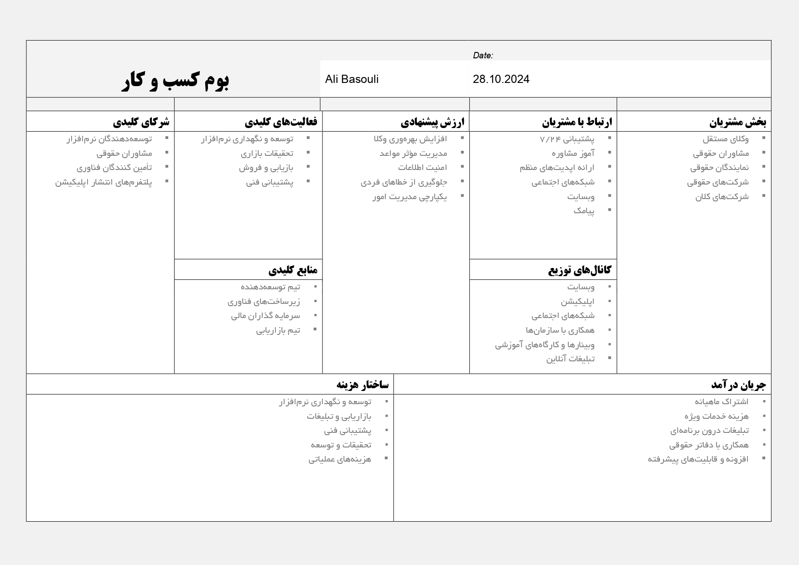

# University Project

## Startup Idea and Blueprint

- **Student**: [Ali Basouli](https://github.com/Alibasouli)
- **Professor**: [Arioo Barzan](https://github.com/arioobarzan)

## Main Idea `in nutshell`
+ A planning app `specially` made for `attorneys`
  * **Status**: *ongoing*
  * **Features**: Comprehensive case management, calendar integration, secure client communication
  * **Technologies**: Implimented in ``Flutter``-``Dart``

## Project Goals
- Enhance efficiency for attorneys in managing their cases.
- Enhance managing meeting and court sessions.
- Provide a secure platform for client-attorney interactions.
- Friendly UI and enhance User experiance quality.

## Business model canva
